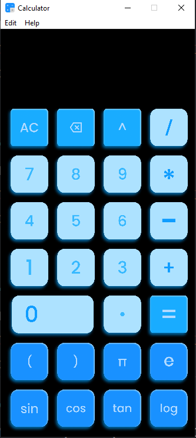

# Modern UI Calculator - Python Tkinter

Welcome to the Modern UI Calculator project! This repository contains the source code and resources for building a stylish and functional calculator using Python and Tkinter. Perfect for beginners and intermediate developers, this project demonstrates modern UI design principles and Python programming techniques.



## Features

- **Modern UI Design:** Sleek and user-friendly interface
- **Basic Arithmetic Operations:** Addition, subtraction, multiplication, and division
- **Responsive Layout:** Adjusts to different screen sizes
- **Error Handling:** Graceful handling of invalid inputs

## Installation

1. **Clone the repository:**
   ```bash
   git clone https://github.com/yourusername/Modern-UI-Calculator-Python-Tkinter.git
   cd Modern-UI-Calculator-Python-Tkinter
